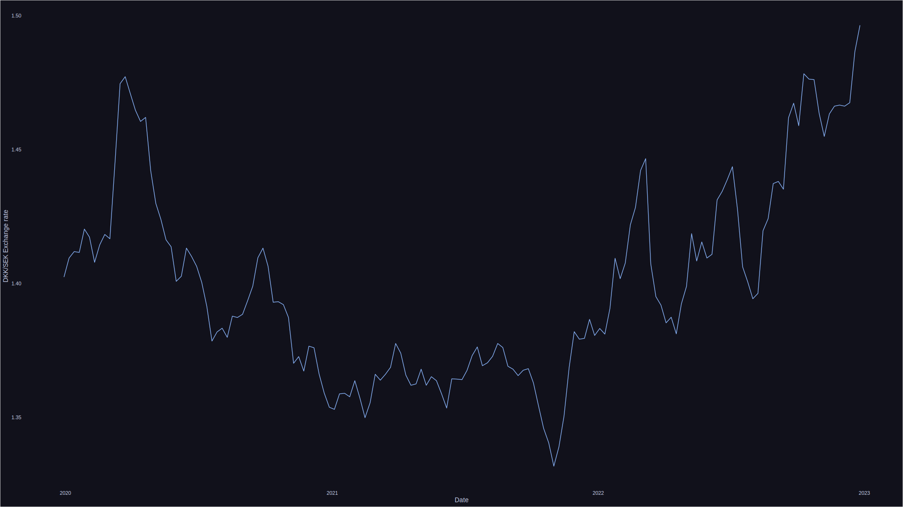

# frankfurteR

This package retrieve the exchange rate from the ECB via the
[frankfurter.app](https://frankfurter.app) api.

## Install

# Installation

You can install this package using the [pak package](https://pak.r-lib.org/):

```R
pak::pkg_install("mackrics/frankfurter")
```

## Get latest exchange rate between DKK and SEK

```r
get_latest_exr("dkk", "sek")
```

## Get time-series between DKK and SEK

```r
get_historical_exr("dkk", "sek", "2020-01-01", "2022-01-01")
```
## Example plot

```r
#> Install packages with:
#> pak::pkg_install("mackrics/frankfurter")
#> pak::pkg_install("mackrics/ricethemes")
#> pak::pkg_install("ggplot2")
library(frankfurter)
library(ricethemes)
library(ggplot2)

get_historical_exr("dkk", "sek", "2020-01-01", "2023-01-01") |>
  ggplot() +
  aes(date, rate) +
  geom_line(color = ctp_mocha[["blue"]]) +
  theme_ctp(ctp_mocha) +
  labs(x = "Date", y = "DKK/SEK Exchange rate")
```


